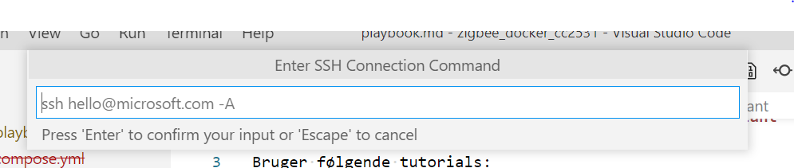
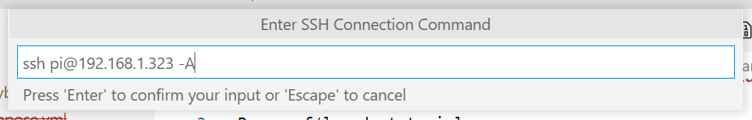

# Zigbee, mqtt med Mosquitto, zibgee2mqtt, Home Assistant

Bruger følgende tutorials:
* <https://www.zigbee2mqtt.io/guide/getting-started>
* <https://medium.com/swlh/using-docker-compose-to-build-zigbee-infrastructure-336983a6ad67>

Så:
* Jeg bruger en Raspi.
* SSH til denne
* VS Code extension "Remote SSH"
  * pt. er den på wifi ssid: LinEmb `ssh pi@192.168.1.232`
    * som jeg taster i ovenstående
        
         Ups der står `.323` det skal være `.232`
